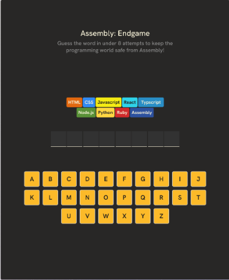
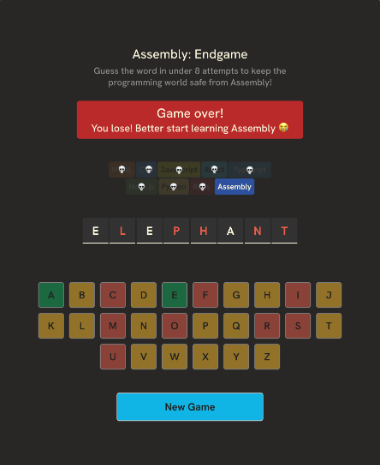
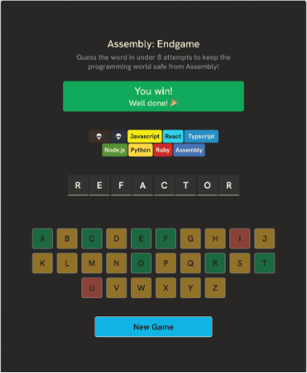

# 🧩 Assembly: Endgame
## Capstone Project for Scrimba's Learn React Course
This is a game called Assembly: Endgame.
The goal of the game is to find the correct word before running out of attempts.

## How to Play
1. Click a key on the keyboard to make a guess.
2. If the guessed letter is in the word, it will be revealed in the word display.
3. If the guessed letter is not in the word, you will lose a programming world word.
4. The game ends when you either guess the word correctly or run out of attempts.
5. You can start a new game by clicking the "New Game" button.






🔗 Design in Figma: [Link](https://www.figma.com/design/VJNO8MeMT3E0B2twQ1HajU/Assembly--Endgame?node-id=0-1&p=f&t=hJnPqk3ezPayNGhj-0)


---

## 🌍 Demo

- Live: https://mirkobechini.github.io/assembly-endgame/

---

## 🛠️ Tech Stack

- **React**: User Interface
- **CSS**: Styling
- **Vite**: Build tool
- **Figma**: Design
- **Nanoid**: Unique ID generation
- **clsx**: Conditional class names
- **react-confetti**: Confetti animation

---

## 🚀 Quick Start

### Requirements

Before you begin, ensure you have installed:

- Node.js (v18+)
- npm (included with Node.js)

### Installation

```bash
# Clone the repository
git clone https://github.com/mirkobechini/assembly-endgame.git

# Entra nella cartella del progetto
cd assembly-endgame

# Installa le dipendenze
npm install
```

### Start

```bash
npm run dev
```

Open your browser at `http://localhost:5173`.

---

## 📂 Project Structure

```text
.
|-- src/
|-- public/
|-- readme-images/
|-- README.md
|-- package.json
```

---

## 🗺️ Roadmap

- [x] Header Section
- [x] Status Section
- [x] Language List
- [x] Word Display
- [x] Keyboard
- [x] Save the guessed letters
- [x] Keyboard letter styles for guesses
- [x] Only display correctly guessed letters in word
- [x] Wrong guess count
- [x] Lost languages
- [x] isGameOver
- [x] Display won/lost status
- [x] Conditional rendering with a helper function
- [x] Farewell messages
- [X] Disable keyboard when game is over
- [x] Make the game more a11y-firendly
- [x] Choose random word
- [x] New game button resets the game
- [x] Display missed letters when lost
- [x] Deploy

---

## 🤝 Contributing

Contributions improve the project. To contribute:

1. Fork the repository
2. Create a branch: `git checkout -b feature/FeatureName`
3. Commit your changes: `git commit -m "Add FeatureName"`
4. Push the branch: `git push origin feature/FeatureName`
5. Open a Pull Request

---

## 📄 License

Distributed under the MIT License. See the `LICENSE` file for details.

---

## 📧 Contact

Mirko Bechini - LinkedIn: (https://www.linkedin.com/in/mirko-bechini-892202252) - mirkobechini@gmail.com

Project link: https://github.com/mirkobechini/assembly-endgame
